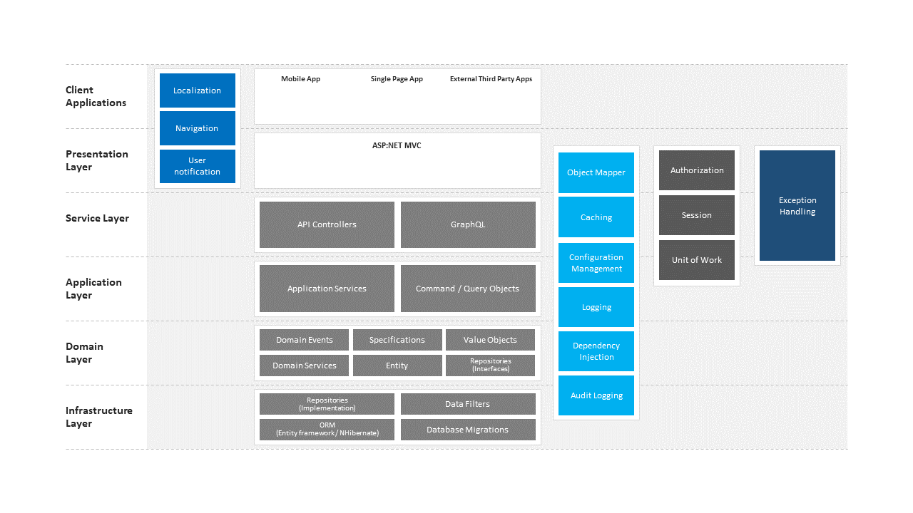

# Clean Architecture Project Template
> This is my own internal clean architecture project template to be used for any greenfield projects I am starting on.
> for .NET based projects

## How do I use it?

You will need some of the following tools:

* Docker
* Visual Studio 2017
* .Net Core 2.1

## Overview

This application is intended as a best practise .NET solution that can be used as a starting template for new Greenfield projects. The architecture for the application intends to follow a clean architecture approach in the way the software is organised to make it easy to develop and evolve. As a result the proposed architecture layer follows DDD principals with CQRS pattern.

### Client Applications

In this layer you typically have your remote clients accessing the logic of the application (usually exposed as REST endpoints). Clients in this layer are usually single page applications, mobile applications and basically any other third party application.

### Presentation Layer

This is usually an internal web application and in the .NET world this would be the MVC web application. This layer interacts with the application service through the application layer.

### Application Layer

This layer contains the application services which would usually interact directly with domain objects and services to perform the use cases specific to the application. This layer also utilises command and query DTO objects as part of the CQRS pattern.

### Domain Layer

Also sometimes referred to as core, this layer holds the domain objects and services. In addition it can also include interfaces, domain events and specifications.

### Infrastructure Layer

The infrastructure layer deals with external systems. From hosting, email and third party API services through to database, logging and cache management. 

